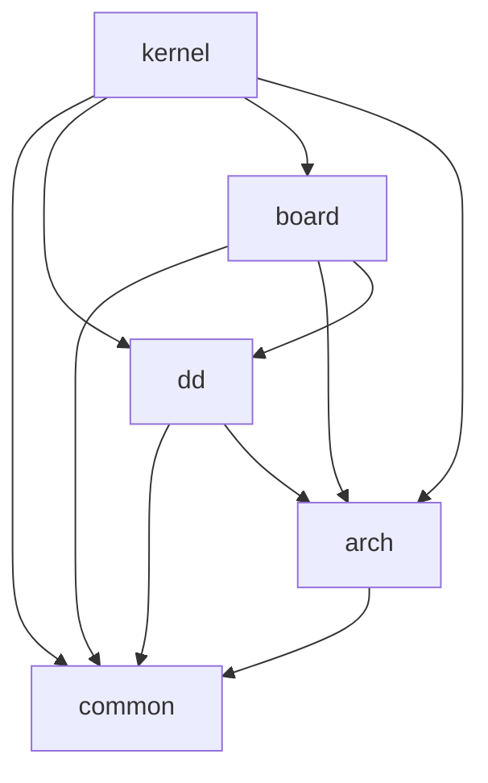
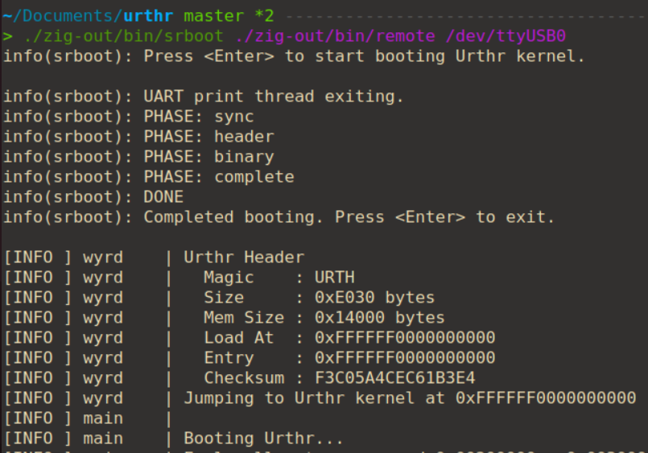
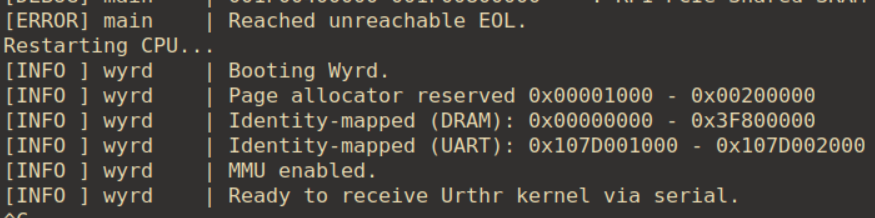

「気が向いたので自作 OS on Raspberry Pi 5 in Zig を書いてみよう」シリーズのパート1です。

https://github.com/smallkirby/urthr

---

## 概要

最近すごく寒いので、自作OSを書くことにした。ここ2年ほどで、以下のシステムプログラムを趣味グラミングした:

- [Ymir](https://github.com/smallkirby/ymir): x64 Type-1 Hyper visor。[ブログ](https://hv.smallkirby.com/)も書いた。
- [Norn](https://github.com/smallkirby/norn): x64 OS。busybox を動かせるくらいまではできた。
- [Hugin](https://github.com/smallkirby/hugin): Aarch64 Type-1 Hypervisor。[作って理解する仮想化技術](https://gihyo.jp/book/2025/978-4-297-15012-9)  の移植。

これらはすべて QEMU 上で開発したものであり、実機での動作を確認していない。どうせOSを書くなら、やはり実機で動かしたいと思うのが人のサガ。というわけで、[Raspberry Pi 5](https://www.raspberrypi.com/products/raspberry-pi-5/) を買ってそこで動くOSを書いてみることにする。このブログシリーズはその備忘録。

## モチベーション

- Aarch64 の勉強をしたい
    - x64 で育ってきた人間なので、aarch64 の勉強をしたい。他に興味があるのは、AMD (やるなら hypervisor) と RISC-V
- 自分で書いたOSを実機で動かしたい
    - 実機特有のバグに悩みたい
- 自由にコードを書きたい
    - 仕事で要求されるような品質ではない、ただ書きたいコードを書くプログラミングは、楽しい
    - OS 自作は、もっと自由でいい [^freedom]

## 機材

用意したものは以下:
- Raspberry Pi 5
    - Broadcom BCM2712, 2.4GHz, 4-cores, Cortex-A76
    - LPDDR4X-4267 SDRAM 8GB
- USB SDカードリーダ
    - Anker, 848061084764 (UPC)
- microSD
    - KIOXIA, KLMEA064G
    - 64GB (SDXC)。UHS-1 までサポートしてるやつ。別にしてなくてもドライバを書くのは自分なのでどっちでも良い。
- USB - TTL UART コンバータ
    - SH-U09C5
- JST SH 型 3 ピンコネクタ付ジャンパケーブル (1mmピッチ)
    - 専用 UART ポートに繋ぐのに必要 [^uart]
- 5.1V3A 電源アダプタ
    - I-O DATA, PS-0530CB

以上があれば、とりあえずコアの部分の開発に入れる。JTAG も [Pi Debug Probe](https://www.raspberrypi.com/documentation/microcontrollers/debug-probe.html) も持っていないが、今のところは困っていない。

## 開発

### 使用言語と命名

Rust と迷ったが、Zig で書く。Zig はすべてが safe (書いた人が全能と仮定した場合) だから、安心。プロジェクト名は大事。C++ の namespace のように Zig ではモジュールアクセスを FQDN で行うため、快適性のために4文字以下であることが必須条件。God of War をやってからは北欧神話の登場キャラの名前をつけるのが好きなので、[Norn](https://github.com/smallkirby/norn) に寄せて運命の三女神の一柱である **[Urthr](https://en.wikipedia.org/wiki/Ur%C3%B0r)** にした。モジュール名としては、もっと短い別表記の `urd` を利用する。また、後述する 2nd Loader の名前はこれまた別表記の **Wyrd**にした。字面からも察せられる通り、"奇妙" を意味する英単語である *weird* の語源らしい。引用元は自分です。自作OSは奇妙なくらいで丁度いいという心意気を象徴しています。

### ターゲット環境

Urthr は以下の3つのターゲット環境をサポートする:
- Raspberry Pi 5
- Raspberry Pi 4b on QEMU
- [virt](https://www.qemu.org/docs/master/system/riscv/virt.html) machine on QEMU

開発体験的にはやはり QEMU が優れているため、本命の RPi5 以外にも RPi4 もサポートする。QEMU では Raspberry Pi 4b 用のマシンモデルである [raspi4b](https://www.qemu.org/docs/master/system/arm/raspi.html) が提供されており、一般的なデバイスや HW に依存しないカーネルコアの部分はこちらを使って開発・デバッグすることができる。ただし、*raspi4b* モデルの欠点として PCIe が載っていない。Raspberry Pi 5 には [RP1](https://www.raspberrypi.com/news/rp1-the-silicon-controlling-raspberry-pi-5-i-o-designed-here-at-raspberry-pi/) というサウスブリッジが載っており、多くのペリフェラルはこの I/O コントローラを介して提供される。この RP1 と SoC は [PCIe 接続されている](https://pip-assets.raspberrypi.com/categories/892-raspberry-pi-5/documents/RP-008370-DS-1-rp1-peripherals.pdf) ため、RPi5 のOS開発には PCIe ドライバは必須となる。この他にも *raspi4b* モデルでサポートされないデバイスを補完するために、QEMU の *virt* Generic Virtual Platform モデルもサポートすることにする。今後 virtio で手っ取り早く上位層のドライバの動きを確かめたいという場合にも役立つことを期待している。

### プロジェクト構成

プロジェクト全体は以下の構成:
```sh
urthr
├── boot.zig
├── build.zig
├── tools
│   ├── mkconst
│   ├── mkimg
│   └── srboot
├── urthr
│   ├── arch
│   ├── board
│   ├── common
│   ├── dd
│   └── kernel
└── wyrd
```

`wyrd` は後述する 2nd Loader。`tools` はビルドや実機との接続に使う補助ツール。`urthr` がメインのソースディレクトリで、以下の4つのモジュールに別れている:

- `common`: 全モジュールから利用可能。プラットフォームに依存せず、ユーザランド用にビルドして実行することもできる。
- `arch`: CPU アーキテクチャ層。今の所ターゲットは `aarch64` のみだが、*virt* モデル用に `x64` を生やす可能性も若干ある。
- `dd`: デバイスドライバ。ボードに依存しないジェネリックな実装。PCIe とか PL011 とかはここ。
- `board`: ボード依存層。ボード特有の処理やデバイスドライバが入る。
- `kernel`: カーネルコア。

これら5つのモジュールは、厳密に依存関係が決められている。Zenn でも Mermaid 記法を使えると聞いたので使ってみたら、なんかすごくごちゃごちゃした依存関係みたいになってしまったが、自分は悪くない。世の中の大抵のことは梅雨が悪い:


上位のモジュールに直接アクセスすることは、言語的に不可能になっている (実装が "漏れ出す" ことで間接的にアクセスできる場合はある)。例えば `dd` モジュールからボード依存の `board` モジュールにアクセスするために以下のように書くとする:

```zig
/// urthr/dd/something.zig

// これはそもそも board モジュールが dd に与えられていないため不可
const impossible = @import("board");
// こっちはビルドエラー
const build_error = @import("../board/hoge.zig");
```

後者の場合、`board/hoge.zig` というファイルが **`board` と `dd` という2つのモジュールから利用される**ことになり、ビルド時にエラーになる。このようにして、言語的にモジュール間の依存関係を強制して逆流することが無いようにしている。

## ブートプロセス

Raspberry Pi シリーズでは、電源投入後に GPU 上で EL3 FW が走り、そいつが CPU を起こしたあと SD カードの bootFS から `kernel_2712.img` をロードして EL2 で実行を開始する[^kernel-name]。別に GPU から起動するとかは全く意識する必要はなく、単純に `kernel_2712.img` という名前でエントリポイントを `0x0020_0000` に持つ実行ファイルを置いておけば良い。ここで問題になるのが、**わざわざ SD カードにカーネルを焼き直すのが非常にめんどくさい**こと。マイクロSDに爪を立てて抜き取り、SDリーダに挿してイメージを焼いてまた RPi5 に挿して... などとやっているとあっという間に日が暮れてしまう。ここで *Wryd* 2nd Loader が登場する。
Wyrd は `kernel_2712.img` という名前で SD にインストールされ、実行されると以下を行う:

- 必要最低限の HW セットアップ (UART のみ)
- MMU の有効化と論物一致マップの作成
- UART から Urthr ヘッダを待ち受ける
- Urthr ヘッダの情報をもとに、kernel イメージの受信・DRAM へのロード・kernel 用仮想アドレスのマップ
- Urthr のエントリポイントにジャンプ

これにより、Wyrd をリビルドしない限りは SD カードを抜き差しすることなく新しいカーネルを実行することが可能になる。RPi5 の UART は 921600 Bd をサポートしていることに加え、現在の Urthr カーネルは Debug ビルドで 648 KB しかないため、UART 経由でカーネルを送信しても5秒程度で起動できる (ReleaseSmall ビルドだと 60 KB で、1秒ほどで起動する)。もしカーネルが肥大化して送信に時間がかかるようになったら、適当に圧縮・伸長ロジックでも入れれば良い。



注意点として、この方法を前提にしてしまうと RPi4 on QEMU / virt モデルで起動させるのが面倒になってしまう。よって、Wyrd は UART 起動モードの他にも In-Memory ブートモードもサポートしている。このモードでは、Wyrd が自分自身の末尾に付与された Urthr kernel イメージを UART から受け取ったものとして同様にしてロードしてくれる。詳細は後述する `mkimg` ツールにて。

ここまでやっても、まだ RPi5 をリセットしないとカーネルをロードできないという問題点が残る。RPi4b までは電源ボタンすら無かったらしいが、RPi5 からは電源ボタンが搭載され、これを5秒ほど長押しすると再起動がかかる。しかし、わざわざ電源ボタンを5秒間も押すのはめんどうくさい。5秒あったらなんでもできる。多分大統領にもなれる。よって、Urthr kernel がアボートしたり EOL に達したら Watchdog Timer を使ってソフトウェアリセットをかけるようにした。これにより、手動で電源ボタンを押さずともすぐにカーネルを送って再実行することが可能になる。嬉しい:



## 補助ツール

Urthr は以下の3つの補助ツールがビルドプロセスに組み込んで利用している。

### `mkimg`

先述した 2nd Loader である Wyrd と、カーネルである Urthr の2つのイメージをいい感じに作ってくれるやつ。UART 起動モードの場合には、`kernel_2712.img` には Wyrd バイナリしか入っておらず、UART で送る用の Urthr Header + Urthr Kernel イメージが作られる。In-Memory 起動モードの場合には、`kernel_2712.img` は  Wyrd + Urthr Header + Urthr Kernel が全部入った全部混ぜイメージとなる。最初は Wyrd も Urthr も単なる ELF ファイルとしてコンパイルした後、生成物を `mkimg` に渡すと指定したモードに応じた以下のようなイメージを作ってくれる:

```zig
//! ## In-Memory boot mode (RPi4 / virt)
//!
//! +-----------+
//! |   Wyrd    |
//! +-----------+
//! |  Header   |
//! +-----------+
//! |   Urthr   |
//! +-----------+
//!
//! ## UART boot mode (RPi5)
//!
//! +-----------+
//! |  Header   |
//! +-----------+
//! |   Urthr   |
//! +-----------+
```

### `mkconst`

リンカスクリプトやアセンブリから Zig で定義した定数にアクセスするためのヘッダファイルを生成してくれるやつ。C ではヘッダファイルをリンカスクリプト `.lds` からインクルードして使うことができるが、当然リンカスクリプトは Zig のコードを理解してくれないので、`mkconst` が間に入ってくれる。いつかは Zig でリンカスクリプトも書けるようになってくれないかな。
以下のような定数の Zig の定義があった場合に:

```zig
pub const Range = struct {
    /// Start address (inclusive).
    start: usize,
    /// End address (exclusive).
    end: usize,
};

pub const kernel = Range{
    .start = 0xFFFF_FF00_0000_0000,
    .end = 0xFFFF_FFF0_0000_0000,
};
```

`mkconst` はビルド時に以下のようなヘッダファイルを生成してくれる:
```c
#define V_KERNEL_START 0xFFFFFF0000000000
#define V_KERNEL_END 0xFFFFFFF000000000
#define V_KERNEL_SIZE 0xF000000000
```

あとは、これをリンカスクリプトの中でインクルードして:
```ld
#include <constants.autogen.h>
SECTIONS
{
    . = V_KERNEL_START;
    ...
}
```

ビルドプロセスの中であらかじめプリプロセスしてくれるように仕込んでおけば、通常のリンカスクリプトとして利用できる [^cpp]:
```zig
fn preprocess(b: *std.Build, input: LazyPath, output: []const u8, deps: []const LazyPath) struct { LazyPath, *InstallFile } {
    const run = b.addSystemCommand(&.{"cpp"});
    run.addArg("-P");
    run.addArg(b.fmt("-I{s}/include", .{b.install_path}));
    for (deps) |dep| {
        run.addPrefixedDirectoryArg("-I", dep.dirname());
        run.addFileInput(dep);
    }
    run.addFileArg(input);
    ...
}
```

### `srboot`

Wyrd の UART 起動モード用にカーネルイメージをプロトコルに従って送信してくれるやつ。このプロトコルは超絶難解で常人には理解するのは難しいだろうが、一応説明すると以下のようになっている:
- `srboot` が "ACK" 文字列を送る
- Wyrd が "ACK" 文字列を送り返す
- `srboot` が Urthr ヘッダ (固定長) を送る
- Wyrd が "ACK" 文字列を送り返す
- `srboot` が Urthr カーネルイメージを送る (ヘッダにサイズが記載)
- Wyrd が "ACK" 文字列を2回送り返す

難しすぎたね、ごめんね。

## 初期のメモリ配分

Wyrd から Urthr に処理が渡ってきた段階では、MMU 有効で DRAM と PL011 のみが論物一致マップ・カーネルイメージが ELF が要求する仮想アドレスにマップされている。この Wyrd が作るページテーブルや、その他ちょっとした作業領域が欲しい場合用のページを割り当てる必要があるが、この段階ではページアロケータが存在しないというジレンマがある。Urthr では、ページアロケータの初期化が済むまでは以下のような物理メモリ配分をしている:

| DRAM  | 物理アドレス                                  | 用途                     |
| ----- | --------------------------------------- | ---------------------- |
| DRAM0 | `0x0000_0000` - `0x3F80_0000`           | (1016 MiB)             |
|       | `0x0000_0000` - `0x0020_0000`           | Wyrd 作業領域              |
|       | `0x0020_0000` - `0x0040_0000`           | Wyrd イメージ / Urthr 作業領域 |
|       | `0x0040_0000` - `KernelEnd`             | Urthr イメージ             |
| DRAM1 | `0x0000_4000_0000` - `0x0002_0000_0000` | (7168 MiB)             |

Wyrd 作業領域には初期のページテーブルが配置される。Urthr の起動後は Wyrd イメージ領域は不要になるため、Urthr は初期の作業領域としてここを利用し、新しいページテーブルもここに作成する。Wyrd が提供するページテーブル等をすべて Urthr のもので置き換えた後は、Wyrd の作業領域も Urthr が再利用することができるようになる。ページテーブルを初期化した後は、この辺の管理は全部ページアロケータがやってくれるようになる。面倒なことは全部ページアロケータにやらせよう。

## 現時点のドライバたち

現時点で書いたドライバたちは、以下のイカれた野郎どもだ！:

- PL011 (GPIO 経由ではなく Dedicated Pin の方)
- RP1 PCIe
- pinmux (GPIO + pad)
- RP1 Mailbox
- RP1 Shared SRAM
- Power Management (リセットのみ)
- SD Host Controller (カードの初期化のみ)

RPi5 固有のものについてはドキュメントが殆どないので、唯一の公式ドキュメントは [Linux カーネル](https://github.com/raspberrypi/linux)ということになる。中の人が書いてるからね。いつも思うんだけど、こういう仕様が無いコードってどうやってレビューしてるんだろうね。
ちなみに DeviceTree は使っていない。パーサを書くのがめんどいのと、そもそも自分が DT を理解していないので。ソースにベースアドレスをハードコードして、ドライバに API を介して与えるような設計になっている (ドライバ自体はベースアドレスに依存しない)。

### PL011 (Dedicated Port)

書くだけ！SoC 直通のため、HW 固有の設定とかも特にない。以前書いたものを全くそのまんま使い回した。ベースアドレスは `0x0010_7D00_1000`.
素直に動いたように書いたが、最初に書いただけあって Normal Memory としてマップしてしまうミスを犯した。よってキャッシュが効いてしまい、RPi5 から PC への書き込みは正常に行われるが、RPi5 が PC から受信する際に 99% の確率でデータが来ていないとご検知するバグにハマった。実機らしいバグで嬉しかった。

なお、これに懲りたのでとりあえずカーネルイメージを Normal Memory, non-cacheable でマップしたところ、スピンロックを取得するところで Data Abort するという事象にもハマった。どうやら `ldaxr` 等のアトミック命令で使う排他モニタは cacheable なメモリでしか使えないらしい。これで発生する Data Abort は ELR が不正な状態になっているため、デバッグが大変だった。

### RP1 PCIe

**RP1** は RPi5 に載っているサウスブリッジ。Cortex-M3 が2コア載っているらしい。多くのペリフェラルが RP1 経由で接続されているため、色々やるにはまず RP1 と PCIe 接続する必要がある。RP1 に接続されたペリフェラルの概要はこの [PDF ](https://pip-assets.raspberrypi.com/categories/892-raspberry-pi-5/documents/RP-008370-DS-1-rp1-peripherals.pdf) に説明があるが、一部はすでに legacy 化しているらしい (GPIO等)。RP1 との繋ぎ方の概要は [KernelVM Tokyo 17 のこのスライド](https://speakerdeck.com/tnishinaga/kernelvm-tokyo17) がわかりやすい。PCIe の Host Controller の物理アドレスは `0x0010_0012_0000`。以下のような設定をした:

PCI-to-PCI Bridge の設定:

| 設定項目                  | PCI Address    | 説明                  |
| --------------------- | -------------- | ------------------- |
| MemBase               | `0x0000_0000`  | めんどいので全 PCI アドレスを流す |
| MemLimit              | `0x0000_8FFF`  | ↑                   |
| Prefetchable MemBase  | `0x0000_0000`  | ↑                   |
| Prefetchable MemLimit | `0x0000_8FFFF` | ↑                   |

BAR の設定:

| BAR | PCI Address   | 説明          |
| --- | ------------- | ----------- |
| 1   | `0x0000_0000` | ペリフェラルたち    |
| 2   | `0x0040_0000` | Shared SRAM |


Address Translation の設定 (AXI アドレスとして、PCI0 は `0x001C_0000_0000`, PCI1 は `0x001F_0000_0000` が使えるらしい):

| Window | AXI Address        | PCI Address | Size          |
| ------ | ------------------ | ----------- | ------------- |
| 0      | `0x001C_0000_0000` | `0`         | `0x0080_0000` |

このようにしたとき、ペリフェラル + `0x0` の位置に RP1 の Chip ID が置いてあるらしい。自分の場合は `0x20001927` だった。また、RP1 の Vendor ID は `0x1DE4` ・Device ID は `0x0001` だった。

### pinmux

今の所使う機会はないけど、とりあえず書いた。RP1 のデータシートに載っている値は古いらしいので、厳密な定義は [gpiochip_rp1.c](https://github.com/raspberrypi/utils/blob/230d67ad28e74b17a42064453b2163991cb51a5e/pinctrl/gpiochip_rp1.c) を参照すると良い。RP1 上での GPIO / RIO / pads のマップは以下:

```zig
    .{ 0x000D_0000, mmio.Marker(.io_bank0) },
    .{ 0x000E_0000, mmio.Marker(.rio_bank0) },
    .{ 0x000F_0000, mmio.Marker(.pad_bank0) },
```

バンクは3つあり、各バンクは `0x4000` ずつ離れている。各バンク内のレジスタ配置レイアウトは以下。`Status` / `Ctrl` はこの組が `0x08` 間隔で並んでいる:

```zig
/// GPIO module.
const Gpio = mmio.Module(.{ .size = u32 }, &.{
    .{ 0x00, Status },
    .{ 0x04, Ctrl },
});
/// RIO (Registered I/O) module.
const Rio = mmio.Module(.{ .size = u32 }, &.{
    // TODO
});
/// PADs module.
const Pads = mmio.Module(.{ .size = u32 }, &.{
    .{ 0x00, VoltageSelect },
    .{ 0x04, Pad },
});
```

### RP1 Mailbox + Shared SRAM

RP1 の BAR2 には Shared SRAM がマップされている。この Shared SRAM  + `0xFF00` に RP1 の M3 コアに対するコマンドを書き込むことで、データのやり取りをすることができる[らしい](https://github.com/raspberrypi/linux/blob/3b2b4267d502acb3f9183ceca20719c30e60fca3/drivers/firmware/rp1-fw.c)。とはいっても M3 はこの領域を監視しているわけではなく、Mailbox モジュールに存在する Doorbell レジスタを鳴らしてあげる必要がある。例えば RP1 FW のバージョンを取得するには以下のようにする:

```zig
pub fn getVersion() Version {
    var buf: [*]volatile u32 = @ptrFromInt(sram.getMarkerAddress(.shmem));

    buf[0] = @bitCast(Command{
        .op = .get_fw_version,
        .data_len = 0,
    });
    buf[1] = 0;

    // Issue command.
    mb.notify(.fw);

    // Wait for completion.
    while (!mb.checkIrq(.fw)) {
        std.atomic.spinLoopHint();
    }

    // Process response.
    if (bits.isset(buf[0], 31)) {
        @panic("RP1 FW command failed");
    }
    const version = bits.concatMany(
        u160,
        .{ buf[1], buf[2], buf[3], buf[4], buf[5] },
    );

    // Clear IRQ.
    mb.clearIrq(.fw);

    return version;
}
```

Mailbox では A76 → M3 に通知する場合には `HostEventIrq` (+`0x14`) レジスタに対応するチャネルビットをセットする。今回のコマンドでは FW チャネル (`0x0`) を利用するため、このレジスタの 0 bit 目を建てると、M3 が Shared SRAM + `0xFF00` からコマンドを読み取って、かつ結果を同じく `0xFF00` 以降に書いてくれる。実際に実行してみると以下のようになる:


この値は Linux の起動ログに出てくる値と同じだったため、多分正しい。たぶんね。まぁ別に RP1 の FW バージョンなんてどうでもいいんですが。自作してると、それ自体が意味を持っていると言うよりも、動いていると確信を持てるということに価値があるんです。Sanity Checker です。

### SD Host Controller

SD カードを読むために必要なもの。こいつに一番手こずった。SD カードは以下の手順で初期化する:

- コントローラのリセット
- クロック設定
- 電源設定
- バス設定
- カード初期化
    - CMD0 → CMD8 → CMD55 → ACMD41 → ...

この内、CMD0 までは通るものの CMD8 でレスポンスが返ってこずに2週間ほどを潰した。クロックの設定が悪いのか、HW 固有の Quirk があるのか、もっと上流のクロックが悪いのか、いや流石に PLL SYS は動いてるだろなどなど...。正月はこいつとともに過ごしていたと言っても過言。さてさて、それでは何が問題だったかと言うと、分かってしまうとととてもシンプル。**SD Host Controller だと思って触っていたものが、SD Host Controller ではなかった**。というのも、RPi5 には SoC 直通の MMC コントローラ (`0x0010_00FF_F000`) と、RP1 経由でアクセスする SDIO コントローラ (`+0x0018_0000`) が各2つずつあるのだが、自分は後者を触ってしまっていた。どうやらマイクロ SD を司っているのは前者らしい。SDIO の方もなまじ CMD0 までは通るから沼ってしまった...。

MMC コントローラの方を触るようにしたところ、いとも簡単にカードの初期化まで通った。基礎の部分は RPI4b on QEMU で開発していたのだが、ほとんど変更することなく RPi5 実機でも動いた。やっぱり標準化は、偉大なんだ。SDHC の仕様は Simplified 版が無料一般公開されているので参照先にも困らない (完全版は SD Association への加入が必要)。
というわけで、動いている画像。64GB SDXC カードを使っているので、多分正しい:


### I/O マップ

現時点での物理アドレスマップは以下の通り:
```sh
[DEBUG] main    | Memory Map:
[DEBUG] main    | 000000000000-00003F800000    : System RAM
[DEBUG] main    |    000000400000-000000414000 :  Kernel Image
[DEBUG] main    | 000040000000-000200000000    : System RAM
[DEBUG] main    | 001000FFF000-001001000000    : SDHC
[DEBUG] main    | 00107D001000-00107D002000    : PL011
[DEBUG] main    | 00107D200000-00107D201000    : PM
[DEBUG] main    | 001F00000000-001F00400000    : RP1 PCIe Peripherals
[DEBUG] main    |    001F00000000-001F00004000 :  sysinfo
[DEBUG] main    |    001F00008000-001F0000C000 :  syscfg
[DEBUG] main    |    001F00018000-001F0001C000 :  clocks_main
[DEBUG] main    |    001F00030000-001F00034000 :  uart0
[DEBUG] main    |    001F000B0000-001F000B4000 :  sdio0_cfg
[DEBUG] main    |    001F000B4000-001F000B8000 :  sdio1_cfg
[DEBUG] main    |    001F000D0000-001F000DC000 :  io_bank
[DEBUG] main    |    001F000E0000-001F000EC000 :  rio_bank
[DEBUG] main    |    001F000F0000-001F000FC000 :  pad_bank
[DEBUG] main    |    001F00180000-001F00184000 :  sdio0
[DEBUG] main    |    001F00184000-001F00188000 :  sdio1
[DEBUG] main    | 001F00400000-001F00800000    : RP1 PCIe Shared SRAM
```

## 今後の展望

とりあえず、SD カードから initramfs を読めるようにしたい。そのあと、「[ゼロからの TCP/IP プロトコルスタック自作入門](https://book.mynavi.jp/ec/products/detail/id=149014)」を移植したい。ちょっとプロセスの仕組みを実装するのがめんどいので、最初はなんならカーネル内にクライアントを作っても良い。この本がどういうものか実は知らないけど。
あと [Silent Hill f](https://www.konami.com/games/silenthill/f/jp/ja/) の全エンディングをクリアしたい。柴犬と猫を1匹ずつ飼いたい。そのために動物可の物件に引っ越したい。ハイボール飲みたい。

[^freedom]: https://knowledge.sakura.ad.jp/25000/
[^uart]: RPi5 には 40 ピン GPIO から使える UART と、専用の3ピンポートを使う UART が存在する。GPIO 経由のやつはサウスブリッジ接続は必要なので専用ポートを使うと楽。BL のログも見れる。
[^cpp]: 一般的には `build.zig` の中で `addSystemCommand()` を使う事はシステムへの暗黙の依存を生やすことになるため、良くないです。今回は自分の権限を行使して許可します。
[^kernel-name]: ロードされるファイル名は FW によって異なる。RPi4b の場合は `kernel8.img` らしい。
